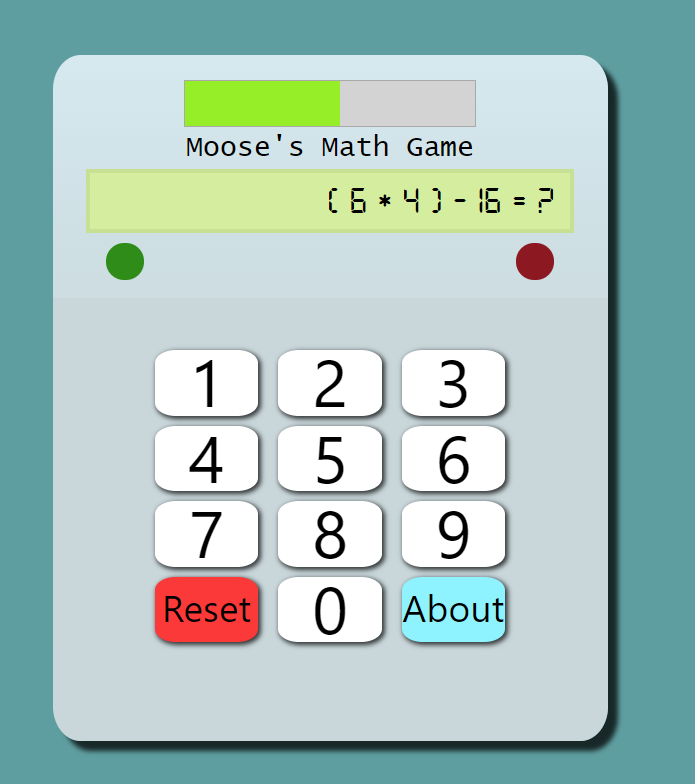

# Randomly-Generated-Math-Game

# [Live Site](https://xmoose25x.github.io/Randomly-Generated-Math-Game/)

## How to play
Instruction are included once you launch the site.
- There are a series of 10 randomly-generated math problems presented to you.
- You have 10 seconds to answer with either 0-9 on your keyboard or on-screen buttons.
- You will be presented a green light for a correct answer and a red light for a wrong answer.
- Your final score will be shown once all 10 questions have been answered.

### Tips
- All operands will be between 0-25.
- Division only occurs when there is no remainder.
- Multiplication only occurs when one of the two numbers is between 0-10.
- Answers will always be between 0-9.

## How it was made
This project is made entirely in Javascript, HTML, and CSS. It also uses Bootstrap v4.6.0 to make things easier. It generates an equation with three operands, two operators, and one set of parentheses. All numbers are positive whole numbers and the answer is always between 0-9. The user will  be able to input this on a keyboard or select from the on-screen number pad. The problems are randomly generated using a simple homemade algorithm.
